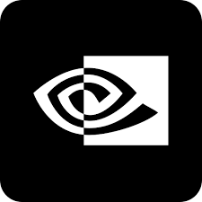

# Hi there 👋, I'm David Wei!

<!--
**david-wei-01001/david-wei-01001** is a ✨ _special_ ✨ repository because its `README.md` (this file) appears on your GitHub profile.
-->

Undergraduate at the [University of Toronto](https://www.utoronto.ca/), Computer Science Specialist\
Researcher at [MEDCVR lab](https://medcvr.utm.utoronto.ca/)/QA Engineer at [Uken Games Inc.](https://uken.com/)

## 🔭 Current Endeavour
Currently, I'm diving deeper into the world of artificial intelligence, LLMs (Large Language Models), and security, seeking ways to blend these technologies with human-computer interaction to create impactful solutions.

## 🌱 My Life
My life journey always goes out of plan, but I'm surviving it!!! 🚴‍♂️💪\
Curious about what's the next thing gonna hit me 🧐🔮\
Unexpected tasks are opportunities for me to improve, be receptive, and be optimistic! 💡🌱😊\
\
**Fun fact:** When I'm not coding 💻 or buried in textbooks 📖, you'll find me lost in the world of books 📚 and cooking 🍳.

## 🧲 What Attracts Me 
- AI, gen AI, LLMs, CV, anything about AI
- Security ([who doesn't want to be a hacker?](https://www.youtube.com/watch?v=3v5Von-oNUg))
- Robotics

  
## 📬 How to Contact Me 
- **Email:** davidjkwei@gmail.com
- [LinkedIn](https://www.linkedin.com/in/david-wei-7a3486280/)
- **Pronouns:** He/Him

## 🛠️ Skills

<table align="center">
  <tr>
    <td align="center" width="96">
      
       Python
    </td>
    <td align="center" width="96">
      
       C
    </td>
     <td align="center" width="96">
       
       C#
    </td>
    <td align="center" width="96">
       
       Java
    </td>
    <td align="center" width="96">
      
       Matlab
    </td>
    <td align="center" width="96">
      
       R
    </td>
    <td align="center" width="96">
      
       LaTeX
    </td>
  </tr>
  <tr>
    <td align="center"  width="96">
        
       HTML5
    </td>
    <td align="center" width="96">
        
       CSS
    </td>
  </tr>
  <tr>
    <td align="center" width="96">
      
       PyTorch
    </td>
   <td align="center" width="96">
      
       TensorFlow
    </td>
   <td align="center" width="96">
     
       Unity
    </td>
   <td align="center" width="96">
     
       CUDA
    </td>
    <td align="center" width="96">
      
         ROS
    </td>
    <td align="center" width="96">
      
       NumPy
    </td>
    <td align="center" width="96">
      
       Linux/Unix
    </td>
 </tr>
  <tr>
  <td align="center" width="96">
    
       Vertex AI
    <td align="center" width="96">
      
       ChatGPT
    </td>
    <td align="center" width="96"> 
      
       Gemini
    </td>
    <td align="center" width="96"> 
      
       LLaMa
    </td>
    <td align="center" width="96">
      
       Docker
    </td>
    <td align="center" width="96">
      
       Kibana
    </td>
    <td align="center" width="96">
      
       TestRail
    </td>
  </tr>
 
</table>
  

### Programming Languages
- Python 🐍 (PyTorch, TensorFlow, NumPy, SciPy)
- Java ☕
- C/C++ ➕
- C# 🔷
- Matlab 🔢
- Jupyter Notebook 📓
- R 📊
- Shell 🐚 (Bash, ZSH) 
- Assembly 🧩 (MIPS, X86)

### AI, LLMs & Robotics
- prompt design and runtime deployment of ChatGPT 💬, Gemini 🌟, and LLaMa 🦙
- Implementation and deployment of Detectron2 📸
- CUDA and GPU programming 🖥️
- Unity Robotics Hub 🎮
- MoveIt 🤖
- ROS 🌹

### Software & Environment
- Unity (both 2D 🕹️ and 3D 🌐).
- Linux/ Unix 🐧
- Google Vertex AI ☁️
- Docker 🐳
- TestRail 🚄
- Bridge 🌉
- Kibana 📊

[🤔](https://david-wei-01001.github.io/Some-Jewels/)

