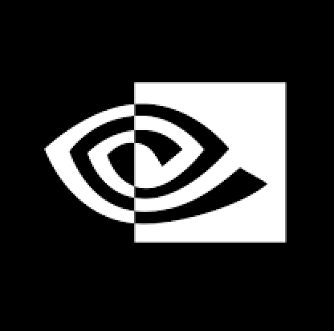
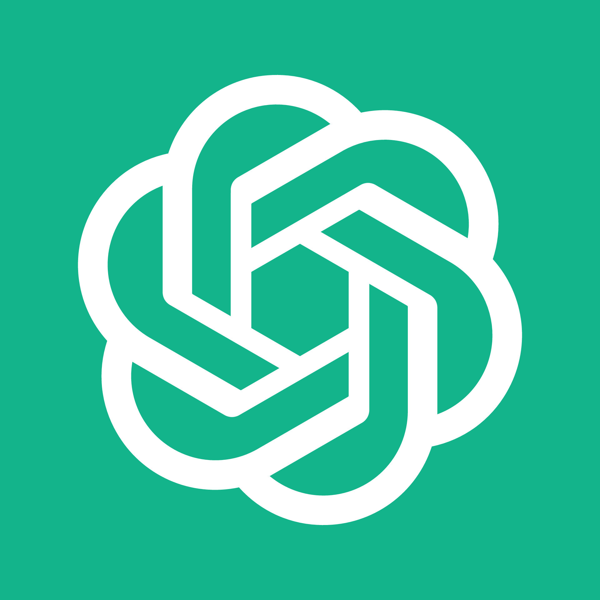
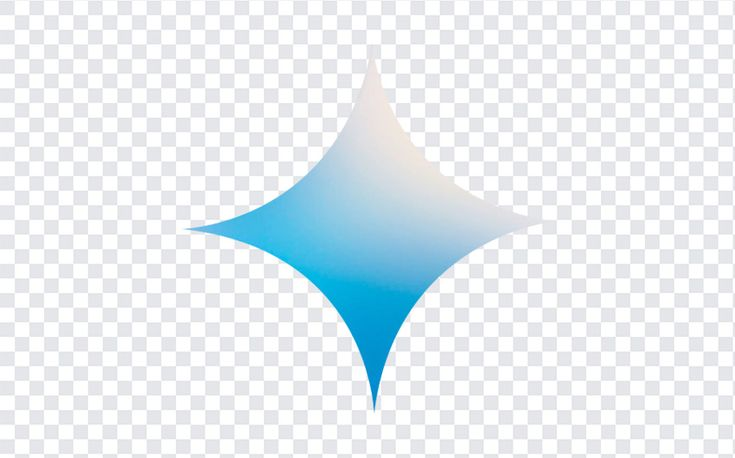
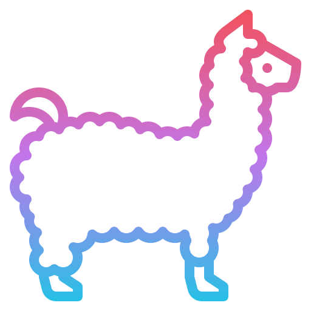
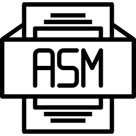

# Hi there 👋, I'm David Wei!

<!--
**david-wei-01001/david-wei-01001** is a ✨ _special_ ✨ repository because its `README.md` (this file) appears on your GitHub profile.
-->

Undergraduate at the [University of Toronto](https://www.utoronto.ca/), Computer Science Specialist\
Researcher at [MEDCVR lab](https://medcvr.utm.utoronto.ca/)/QA Engineer at [Uken Games Inc.](https://uken.com/)
----
**Tech Enthusiast | Programmer | AI Researcher | Book Lover | Amateur Philosopher**

> May my knowledge grow as trees, and my thoughts shed as leaves\
> With which I sail through my years, on the tides of ceaseless change
> 
- David Wei

## 🛠️ Main Skills #
  
  
  
  
  
  
  
  
  <!--
  
  
  -->

## 🔭 Current Endeavour
Currently, I'm diving deeper into the world of artificial intelligence, LLMs (Large Language Models), and security, seeking ways to blend these technologies with human-computer interaction to create impactful solutions.

## 🌱 My Life
My life journey always goes out of plan, but I'm surviving it!!! 🚴‍♂️💪\
Curious about what's the next thing gonna hit me 🧐🔮\
Unexpected tasks are opportunities for me to improve, be receptive, and be optimistic! 💡🌱😊\
\
**Fun fact:** When I'm not coding 💻 or buried in textbooks 📖, you'll find me lost in the world of books 📚 and cooking 🍳.

## 🧲 What Attracts Me 
- AI, gen AI, LLMs, CV, anything about AI
- Security ([who doesn't want to be a hacker?](https://www.youtube.com/watch?v=3v5Von-oNUg))
- Robotics
- [Tactical Nuclear Visual Cards](https://www.bilibili.com/video/BV1zs411o7aD/?spm_id_from=333.337.search-card.all.click)
  
<h2 align="left">📬 How to Contact Me:</h2>
Discord: davidwei01001

<!--

-->
  

      
      
## 🧩 All Skills

<table align="center">
  <tr>
    <td align="center" width="96">
      
       Python
    </td>
    <td align="center" width="96">
      
       C
    </td>
    <td align="center" width="96">
      
       C++
    </td>
     <td align="center" width="96">
       
       C#
    </td>
    <td align="center" width="96">
       
       Java
    </td>
    <td align="center" width="96">
      
       Matlab
    </td>
    <td align="center" width="96">
      
       R
    </td>
    <td align="center"  width="96">
      
       HTML5
    </td>
    <td align="center" width="96">
      
       CSS
    </td>  
  </tr>
  
  <tr>
    <td align="center" width="96">
     
       Unity
    </td>
    <td align="center" width="96">
      
       PyTorch
    </td>
    <td align="center" width="96">
      
       TensorFlow
    </td>
    <td align="center" width="96">
      
       NumPy
    </td>
    <td align="center" width="96">
      
       Linux/Unix
    </td>
   <td align="center" width="96">
     
       CUDA
    </td>
    <td align="center" width="96">
      
       MoveIt
    </td>
    <td align="center" width="96">
      
         ROS
    </td>
    <td align="center" width="96">
      
       Detectron
    </td>
  </tr>
  <tr>
    <td align="center" width="96">
    
       Vertex AI
    <td align="center" width="96">
      
       ChatGPT
    </td>
    <td align="center" width="96"> 
      
       Gemini
    </td>
    <td align="center" width="96"> 
      
       LLaMa
    </td>
    <td align="center" width="96">
      
       Docker
    </td>
    <td align="center" width="96">
      
       Kibana
    </td>
    <td align="center" width="96">
      
       TestRail
    </td>
    <td align="center" width="96">
      
       Assembly
    </td>
    <td align="center" width="96">
      
       Shell
    </td>
   
  </tr>
</table>

-----

  
  
 

 

 

  
 
  
 
 
 
----------------

[🤔](https://david-wei-01001.github.io/Some-Jewels/)
