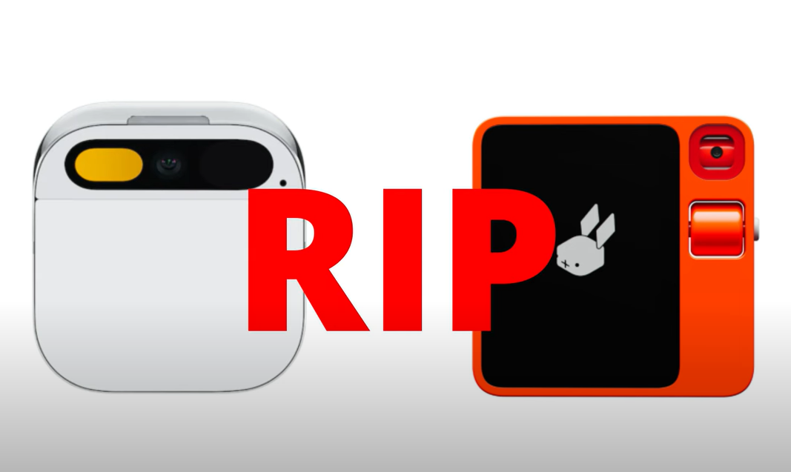

     

# Hi there 👋, I'm David Wei!

<!--
**david-wei-01001/david-wei-01001** is a ✨ _special_ ✨ repository because its `README.md` (this file) appears on your GitHub profile.
-->

Undergraduate at the [University of Toronto](https://www.utoronto.ca/), Computer Science Specialist\
Gen AIResearcher at [Department of Computer Science](https://web.cs.toronto.edu/)/Robotics Researcher at [MEDCVR lab](https://medcvr.utm.utoronto.ca/)/Ex-QA Engineer at [Uken Games Inc.](https://uken.com/)
----
**Researcher on LLM | Tech Enthusiast | Programmer | Book Lover | Amateur Philosopher**

> May my knowledge grow as trees, and my thoughts shed as leaves\
> With which I sail through my years, on the tides of ceaseless change
> 
- David Wei

## 🛠️ Main Skills #

    
    
    
    
    
    
    
    
    
    
    
    
    
    
    
    
    
    
    
    
    

## 🔭 Current Endeavour

- Currently, I'm analyzing vulnerabilities in speculative inference algorithms of LLMs (Large Language Models) by timing GPU executions and studying the possible runtime discriminations inherited from different kinds of proposed speculative inference algorithms.

- I am also continuing my work in MEDCVR on using LLMs to manipulate Robotics on fine-details with error detection and fault tolerance.

## 🌱 My Life
My life journey always goes out of plan, but I'm surviving it!!! 🚴‍♂️💪\
Curious about what's the next thing gonna hit me 🧐🔮\
Unexpected tasks are opportunities for me to improve, be receptive, and be optimistic! 💡🌱😊\
\
**Fun fact:** When I'm not coding 💻 or buried in textbooks 📖, you'll find me lost in the world of books 📚 and cooking 🍳.

## 🧲 ~~What Attracts Me~~ "HER" IS COMMING!!!

- AI, gen AI, LLMs, CV, anything about AI
- Security ([who doesn't want to be a hacker?](https://www.youtube.com/watch?v=3v5Von-oNUg))
- Robotics
- [Tactical Nuclear Visual Cards](https://www.bilibili.com/video/BV1zs411o7aD/?spm_id_from=333.337.search-card.all.click)
  
## 📬 How to Contact Me:

<!--

-->
  

  
Discord

    davidwei01001

      
      
## 🧩 All Skills

### Programming Languages

    
    
    
    
    
    
    
    
    
    
    

    
### Libraries and Frameworks

    
    
    
    
    
    
    
    
    
    
    
    
    
    

### Pretrained Models and AI Frameworks

    
    
    
    
    
    

### Cloud Platforms and Services

    
    
    
    

### Softwares

    
    
    
    
    
    
    

### Development Tools and Editors

    
    
    
     
     
    
    
    
    
    
    
    
    
    

### Operating Systems and Command Line Tools

    
    
    
    
    
    

### Web 3

    

-----

    

 
 

 
 
 
----------------

[🤔](https://david-wei-01001.github.io/Some-Jewels/)

     

